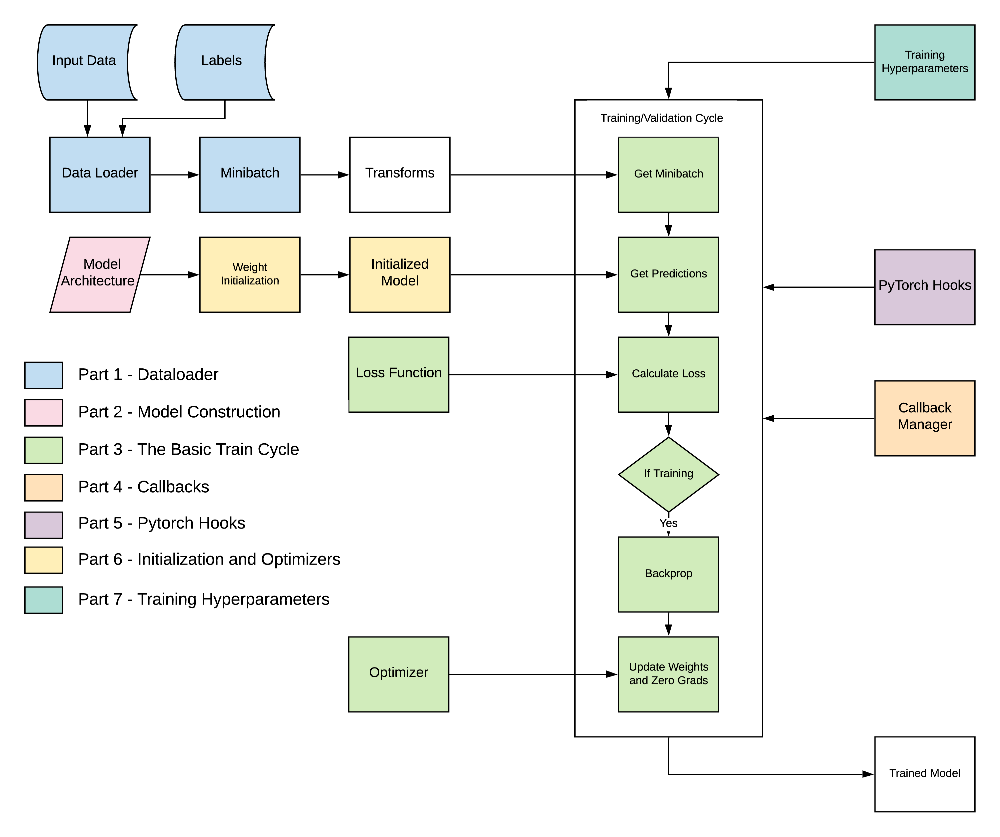
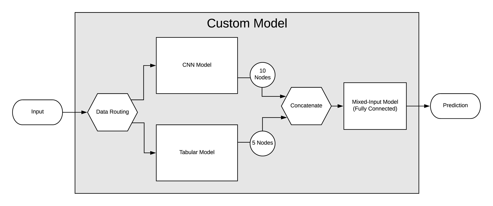

# Mixed-Input-Deep-Learning

## Overview:
Building a platform to train mixed-input deep learning models from scratch.  Based the [lessons from part 2 of fast.ai](#https://course.fast.ai/part2).  To illustrate the concepts, we will be training a model that accepts both tabular and image data and output a single prediction.
This will be a multi-part series, with each part addressing a subset of the total componets as outlined here:

## Requirements:
* fastai
* torch
* torchvision
* numpy
* pandas

## [Part 1 - Dataloader](#Part%201%20-%20Dataloader.ipynb)
Deep learning models are trained on batches. The dataloader is responsible for iterating over the dataset and producing these batches.  To accomplish this we will go over constructing the following components:
* A **Dataset** class, which defines how items are retrieved from the source data
* A **Sampler** class, which outlines how items are sampled from the dataset to assemble the batches
* A **Collate** function, which asssembles the sampled items into the input data batch (xb) and labels batch (yb)
* A **Transform** class, which serves as a placeholder for the transforms that we will introduce later
* A **DataLoader** class, which assembles all the components together.  Once you have your dataloader, you can simply call `for xb, yb in dataloader:` to generate all the batches for one epoch (or round) of training.

## [Part 2 - Model Construction](#Part%202%20-%20Model%20Construction%20and%20Initialization.ipynb)
PyTorch models are composed of nn.Module instances that are strung together in sequence to pass the input data through the model.  We will go over how to create your own modules and assemble them into a custom network:

## [Part 3 - The Basic Train Cycle](#Part%203%20-%20The%20Train%20Cycle.ipynb)
Training involves a specific sequence of steps:
* Run the batch of input data (xb) through the model
* Compare it to the labels using a **Loss Function**, which assigns how the penalty for incorrect predictions is assigned
* A backward step, which calculates the parameter gradients using backpropagation
* An **Optimizer** step, which updates all the trainable parameters of the network
* Reseting all parameter gradients

## [Part 4 - Callbacks](#Part%204%20-%20Callbacks.ipynb)
We can customize training by inserting openings for functions to run at key steps during training (e.g. after the model prediction) called **callbacks**.  We will combine the basic train cycle and callbacks with a new **Learner** class.  This will allow us to customize training without alterning the base code for the trainer.  Callbacks can perform a host of functions ranging from logging training statistics to scheduling training parameters.

## [Part 5 - Pytorch Hooks](#Part%205%20-%20Pytorch%20Hooks.ipynb)
Our callbacks system works well, but doesn't allow us to delve into the individual layers of the network.  Although it is possible to create our own method of doing this through the **HookedSequential** class, we can also make use of the hook system inherent to PyTorch.  

## [Part 6 - Initialization and Training Optimizations](#Part%206%20-%20Advanced%20Optimizers%20and%20Initialization.ipynb)
To be implemented
